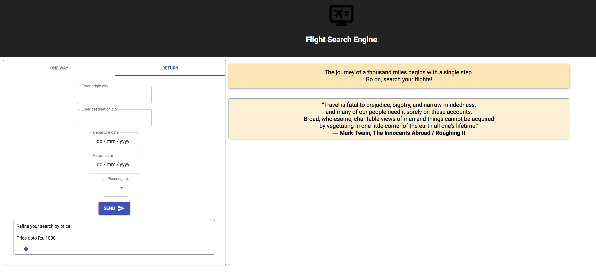
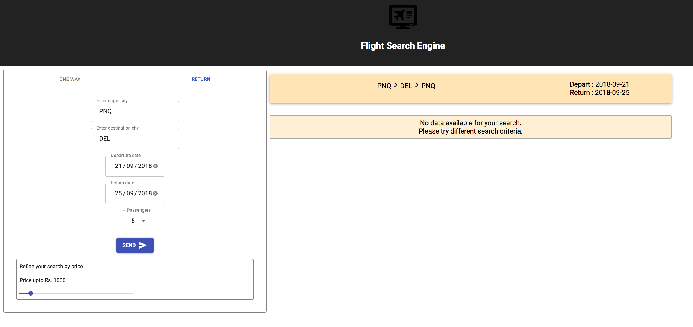
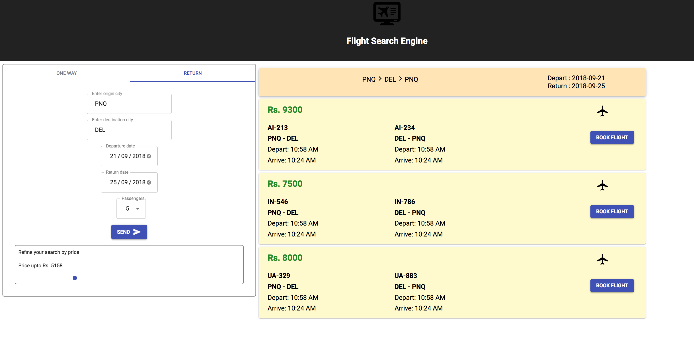

This project was bootstrapped with [Create React App](https://github.com/facebookincubator/create-react-app).

## Available Scripts

In the project directory, you can run:

### `npm start`

Runs the app in the development mode. 
Open [http://localhost:3000](http://localhost:3000) to view it in the browser.

The page will reload if you make edits. 
You will also see any lint errors in the console.

### `npm test`

Launches the test runner in the interactive watch mode. 

## How it looks on initial load
 

## How it looks on search with no data
 

## Move the slider a bit right and boom
 

